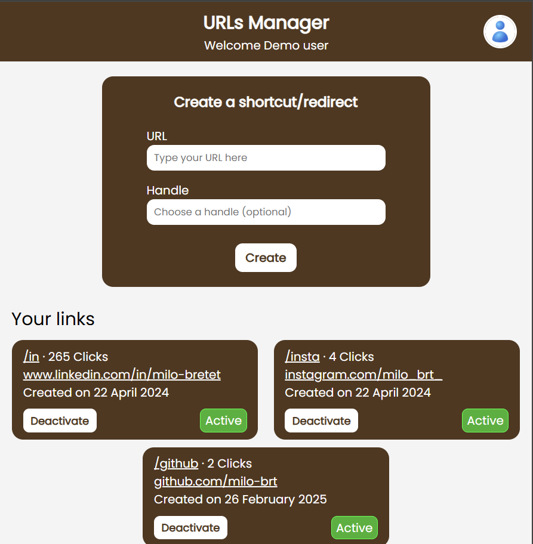

# URL Shortener [personnal project]  

🇬🇧 For the French version, [click here](README_fr.md)

## Description  

`Express.js` application that allows you to create and delete custom URL shortcuts in real-time.

For example, if you have a long URL like `www.google.com/search?q=url+shortener&.....`, you can shorten it to `mysite.com/{your choice}` and share it more easily.

The application also records the creation date and the number of visits for each shortcut. Everything is stored in a `MongoDB` database.

**[ Note ]**: The application is designed to be hosted alongside other applications on a server. To use it, you need to encapsulate it in a `Server` from the `http NodeJs` module.

## Authentication  

To prevent anyone from creating or deleting shortcuts with your domain, the application is protected by an authentication system using `Passport.js`. It uses my own identity provider which also handles the authorization process, but you can easily replace it with another one thanks to `Passport.js` strategies.

## Demonstration  
Here is what the application's interface looks like:

You can test it with the following demo account (read-only access):  

Select login with email"
- **Username**: `demo@milobrt.fr`
- **Password**: `Demo123!`  

It is currently hosted [here](https://urls.milobrt.fr)
